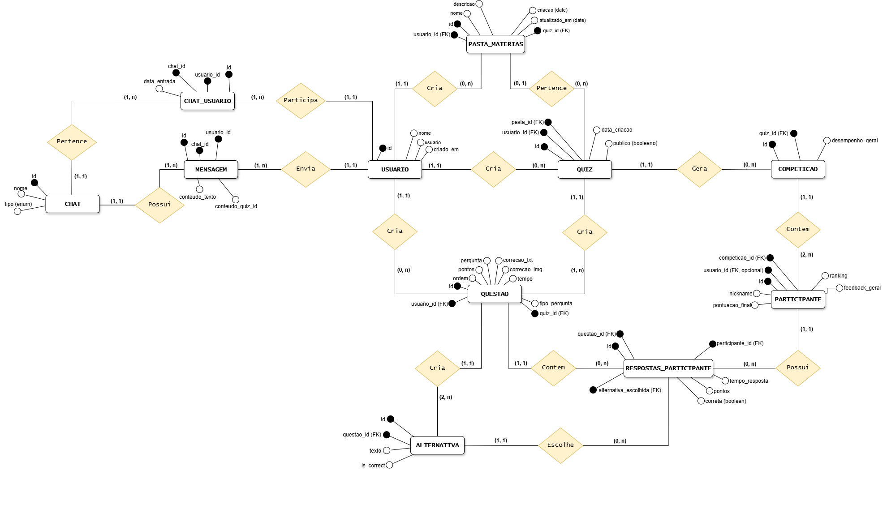
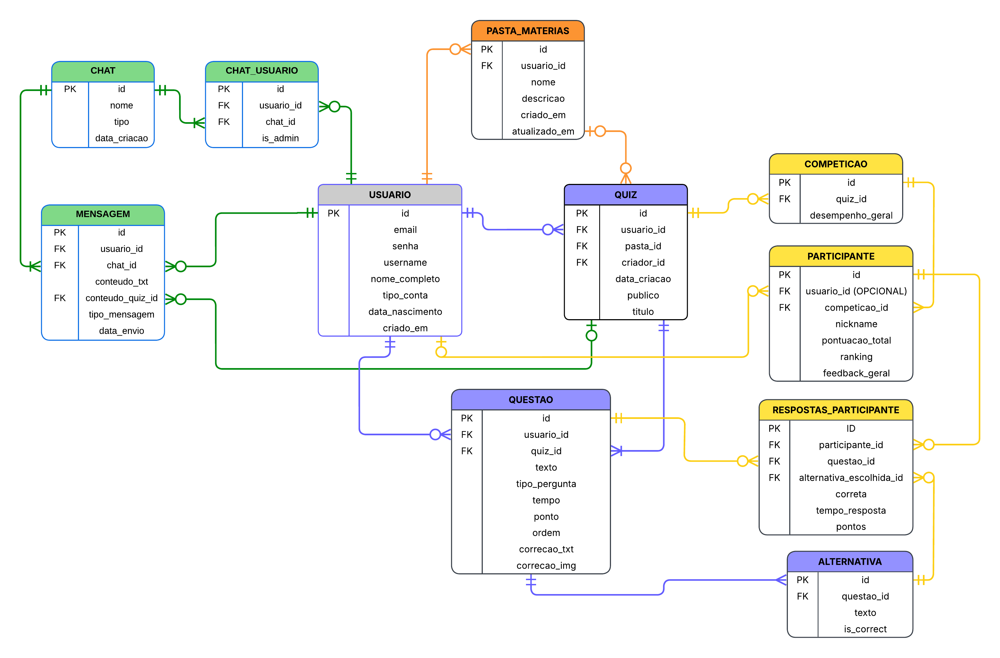

# Modelo de Dados e Estrutura do Banco de Dados

## 1. Decisões e Regras de Modelagem

Este tópico formaliza as decisões que foram tomadas para a remodelagem do banco de dados do sistema para atender aos Requisitos Funcionais (RF) do projeto.

---

### 1.1. Duplicação de Quizzes ao Compartilhar

O sistema contará com um chat de conversas entre os professores e estudantes, onde será possível compartilhar quizzes. 
	
**Regra de Negócio Central:** Quando o usuário adiciona um quiz compartilhado à sua biblioteca, o sistema gera uma nova instância independente do quiz original, realizando uma duplicação completa.

*  **Motivo da duplicação:** Se o quiz compartilhado fosse apenas um ponteiro para o original, qualquer alteração feita pelo criador afetaria todos os usuários que receberam o quiz, o que comprometeria a integridade dos dados e a experiência do usuário.

*  **Implementação no Banco de Dados:** Quando um quiz é compartilhado o sistema duplica a estrutura do quiz completa (`QUIZ`, `QUESTAO` e `ALTERNATIVAS`):
    *   Cria um registro em `QUIZ`, com ID novo.
    *   Duplica todas as questões relacionadas ao Quiz, gera novos IDs.
    *   Duplica todas as alternativas relacionadas a cada pergunta, gera novos IDs.

*	**Atribuição de Autoria:** Para rastrear o criador, foi adicionado um atributo de Chave Estrangeira (FK) na tabela Quiz que referencia o usuário criador.

---

### 1.2. Remoção do Banco de Questões e Reutilização

O Banco de Questões foi retirado do modelo, sendo agora a própria tabela `QUESTOES`, já que toda questão adicionada poderá ser reutilizada. 

*  **Regra de Reutilização:** Ao reutilizar uma questão para um novo quiz, uma nova instância é gerada, com um novo ID. A duplicação ocorre mesmo que a alteração seja mínima, e as alternativas da questão também são copiadas e reutilizadas.

---

### 1.3. Estrutura de Questão e Flexibilidade de Alternativas

A modelagem utiliza duas tabelas separadas: `QUESTAO` e `ALTERNATIVA`. Isso garante flexibilidade, pois o número de alternativas por questão pode ser diferente evitando limitações como número fixo de 2 a 5 alternativas. Além disso, auxilia na coleta de dados para relatórios, permitindo o levantamento da quantidade de alunos que escolheram cada alternativa. A alternativa correta é definida pelo campo `is_correct` (Booleano) na tabela `ALTERNATIVA`. Este modelo permite que sejam definidas múltiplas alternativas corretas por questão.

---

### 1.4. Modelo de Correção

Não haverá uma tabela separada chamada `CORRECAO`. Dois novos atributos serão adicionados na tabela `QUESTAO`: `correcao_texto` e `correcao_img`. A correção é opcional e funciona como um slide adicional na interface, portanto, os atributos são definidos como nulos.

---

### 1.5. Persistência e Conteúdo do Chat

O sistema terá chats em tempo real (Privado – entre dois usuários ou Público – vários usuários), utilizando a biblioteca Flask-socketIO no backend.

*  **Persistência e Backup:** Todas as mensagens serão salvas no banco de dados, como uma forma de backup, para garantir histórico, caso o servidor seja encerrado, não ocorra perda das mensagens.
*  **Validação:** No backend, deverá ser feita uma verificação quanto ao tipo de mensagem (`texto` ou `quiz_id`) para garantir a integridade dos dados ao salvar no banco.

---
## 2. Modelo de Dados
A modelagem de dados do sistema foi desenvolvida de forma progressiva, partindo da identificação das entidades e de seus relacionamentos até a definição dos detalhes necessários para sua implementação. Esse processo é apresentado em três etapas: Modelo Conceitual, Modelo Lógico e Modelo Físico (Dicionário de Dados), permitindo representar o banco de dados desde uma visão mais abstrata até uma estrutura próxima à implementação no SGBD.

## 2.1 Modelo Conceitual (Baixo Nível)

O **Modelo Conceitual** representa a primeira etapa da modelagem de dados, focando na identificação das entidades do mundo real e dos relacionamentos cruciais para o sistema, contendo apenas atributos principais, não sendo necessário o uso de qualquer Sistema Gerenciador de Banco de Dados (SGBD). 

Nesta fase inicial, o objetivo principal é definir o que o sistema deve armazenar (entidades) e como essas entidades interagem (relacionamentos). O diagrama a seguir apresenta a visão inicial das entidades e seus relacionamentos. Dada a complexidade e a quantidade de entidades necessárias para o sistema, o diagrama possui muitos detalhes, servindo como uma visão estrutural do modelo. A tradução completa, com a lista de atributos, suas restrições e tipos de dados, será detalhada no **Tópico 2.3**.

**Figura 1 – Modelo Conceitual de Dados.** Para a especificação detalhada dos atributos, tipos de dados e restrições, consulte o Modelo Físico (Dicionário de Dados) na Seção 2.3.

---

## 2.2 Modelo Lógico (Estrutura Relacional)
O **Modelo Lógico** converte a abstração do Modelo Conceitual para uma representação mais próxima da implementação em um Sistema Gerenciador de Banco de Dados (SGBD). Nessa etapa, todos os atributos são incorporados às tabelas, definindo colunas, chaves primárias e chaves estrangeiras, de modo a garantir a integridade referencial. Essa etapa utiliza, comumente, diagramas de modelo relacional para representar a estrutura dos bancos de dados relacionais.

O diagrama apresentado na **Figura 2** apresenta a estrutura relacional completa, incluindo todas as chaves primárias e estrangeiras e seus respectivos relacionamentos.

**Figura 2 – Modelo Lógico de Dados.** Para o detalhamento da estrutura e dos relacionamentos entre os dados, consulte o Modelo Físico (Dicionário de Dados) na Seção 2.3.

### 2.2.1 Agrupamento Funcional do Diagrama
Para facilitar a compreensão do modelo, as tabelas e os relacionamentos são agrupados por cores, representando a função de cada grupo dentro do sistema:

- **Verde (Chats):** Representa as funcionalidades de comunicação em tempo real, desde a criação de grupos de chat (`CHAT`) até o envio e armazenamento de mensagens (`MENSAGEM`).

- **Azul (Criação do Quiz):** Representa a estrutura de criação de quizzes, questões e alternativas.

- **Laranja (Pastas de Matérias):** Representa a tabela de pastas (`PASTA_MATERIAS`), utilizada para agrupar os quizzes e organizar melhor os conteúdos.

- **Amarelo (Competição):** Representa a lógica da competição, desde a instanciação da partida até o armazenamento das respostas e da pontuação de cada jogador.

- **Usuário (Sem Cor):** A tabela `USUARIO` não possui uma cor específica, pois representa uma entidade central que se relaciona com os demais grupos, sendo utilizada, por exemplo, na criação de quizzes, participação em chats e competições.

## 2.3 Modelo Físico (Dicionário de Dados)
O **Dicionário de Dados** representa o Modelo Físico do sistema, sendo a implementação concreta do Modelo Lógico em um SGBD específico, neste caso, o MySQL. Ele serve como documentação oficial do *schema* do banco de dados.

A função principal do Dicionário de Dados é garantir a integridade, a padronização e a rastreabilidade dos dados do sistema. Isso pode ser observado nos seguintes aspectos:

- **Integridade:** Define as restrições (`NOT NULL` e `UNIQUE`) e as chaves (`PK` e `FK`), garantindo que os dados inseridos sejam consistentes e que os relacionamentos sejam válidos.

- **Padronização:** Estabelece os tipos de dados (`INT`, `VARCHAR`, `ENUM`, entre outros) para cada coluna, garantindo o armazenamento adequado das informações.

- **Rastreabilidade:** Serve como guia para a criação do banco de dados, permitindo verificar se a estrutura implementada corresponde ao modelo definido nos diagramas.

### 2.3.1 USUARIO (Entidade Forte)
| Atributo | Tipo de Dados | PK/FK | Restrições | Descrição |
|---|---|---|---|---|
| `id` | INT | PK | AUTO_INCREMENT, NOT NULL | Chave primária do usuário. |
| `email` | VARCHAR(100) | — | NOT NULL, UNIQUE | E-mail utilizado para login. |
| `senha` | VARCHAR(255) | — | NOT NULL | Senha armazenada como hash criptográfico. |
| `username` | VARCHAR(100) | — | NOT NULL, UNIQUE | Nome de usuário único utilizado para identificação, buscas e chats. |
| `nome_completo` | VARCHAR(200) | — | NOT NULL | Nome completo do usuário. |
| `tipo_conta` | ENUM | — | NOT NULL | Define o perfil do usuário: `Professor` ou `Aluno`. |
| `data_nascimento` | DATE | — | NULL | Data de nascimento do usuário. |
| `criado_em` | DATETIME | — | NOT NULL | Data e hora de criação do registro. |

---

### 2.3.2 CHAT (Entidade Forte)

| Atributo       | Tipo de Dados | PK/FK | Restrições               | Descrição                                          |
| -------------- | ------------- | ----- | ------------------------ | -------------------------------------------------- |
| `id`           | INT           | PK    | AUTO_INCREMENT, NOT NULL | Chave primária do chat.                            |
| `tipo_chat`    | ENUM          | —     | NOT NULL                 | Tipo de chat: `Público` ou `Privado`.              |
| `nome`         | VARCHAR(100)  | —     | NULL                     | Nome do grupo, utilizado apenas em chats públicos. |
| `data_criacao` | DATETIME      | —     | NOT NULL                 | Data e hora de criação do chat.                    |

---

### 2.3.3 CHAT_USUARIO (Entidade Fraca)

| Atributo     | Tipo de Dados | PK/FK | Restrições               | Descrição                                                                                    |
| ------------ | ------------- | ----- | ------------------------ | -------------------------------------------------------------------------------------------- |
| `id`         | INT           | PK    | AUTO_INCREMENT, NOT NULL | Chave primária do registro de associação entre o usuário e o chat.                           |
| `chat_id`    | INT           | FK    | NOT NULL                 | Referência ao chat.                                                                          |
| `usuario_id` | INT           | FK    | NOT NULL                 | Referência ao usuário.                                                                       |
| `is_admin`   | BOOLEAN       | —     | NOT NULL                 | Define se o usuário possui permissões de administração no chat.                              |
| —            | —             | —     | UNIQUE KEY               | `(chat_id, usuario_id)`: garante que um usuário seja associado apenas uma vez ao mesmo chat. |

---

### 2.3.4 MENSAGEM (Entidade Fraca)

| Atributo           | Tipo de Dados | PK/FK | Restrições               | Descrição                                       |
| ------------------ | ------------- | ----- | ------------------------ | ----------------------------------------------- |
| `id`               | INT           | PK    | AUTO_INCREMENT, NOT NULL | Chave primária da mensagem.                     |
| `usuario_id`       | INT           | FK    | NOT NULL                 | Referência ao usuário que enviou a mensagem.    |
| `chat_id`          | INT           | FK    | NOT NULL                 | Referência ao chat.                             |
| `tipo_mensagem`    | ENUM          | —     | NOT NULL                 | Tipo de mensagem: `Texto` ou `Quiz`.            |
| `conteudo_txt`     | TEXT          | —     | NULL                     | Conteúdo da mensagem quando o tipo for `Texto`. |
| `conteudo_quiz_id` | INT           | FK    | NULL                     | ID do quiz duplicado compartilhado.             |
| `data_envio`       | DATETIME      | —     | NOT NULL                 | Data e hora do envio da mensagem.               |

---

### 2.3.5 QUIZ (Entidade Fraca)

| Atributo       | Tipo de Dados | PK/FK | Restrições               | Descrição                                                                                 |
| -------------- | ------------- | ----- | ------------------------ | ----------------------------------------------------------------------------------------- |
| `id`           | INT           | PK    | AUTO_INCREMENT, NOT NULL | Chave primária do quiz.                                                                   |
| `usuario_id`   | INT           | FK    | NOT NULL                 | Referência ao usuário responsável pelo quiz.                                              |
| `pasta_id`     | INT           | FK    | NULL                     | Referência opcional à pasta.                                                              |
| `criador_id`   | INT           | FK    | NOT NULL                 | Referência ao criador original do quiz, considerando a possibilidade de compartilhamento. |
| `data_criacao` | DATETIME      | —     | NOT NULL                 | Data e hora de criação.                                                                   |
| `publico`      | BOOLEAN       | —     | NOT NULL                 | Indica se o quiz é público ou privado.                                                    |
| `titulo`       | VARCHAR(255)  | —     | NOT NULL                 | Título do quiz.                                                                           |

---

### 2.3.6 QUESTAO (Entidade Fraca)

| Atributo        | Tipo de Dados | PK/FK | Restrições               | Descrição                                                  |
| --------------- | ------------- | ----- | ------------------------ | ---------------------------------------------------------- |
| `id`            | INT           | PK    | AUTO_INCREMENT, NOT NULL | Chave primária da questão.                                 |
| `usuario_id`    | INT           | FK    | NOT NULL                 | Referência ao usuário da questão.                          |
| `quiz_id`       | INT           | FK    | NOT NULL                 | Liga a questão ao quiz.                                    |
| `texto`         | TEXT          | —     | NOT NULL                 | Enunciado da pergunta.                                     |
| `image_path`    | VARCHAR(255)  | —     | NULL                     | Caminho da imagem associada à questão, quando houver.      |
| `tipo_pergunta` | ENUM          | —     | NOT NULL                 | Tipo da questão: `Múltipla Escolha` ou `Verdadeiro/Falso`. |
| `descricao`     | TEXT          | —     | NULL                     | Descrição da questão.                                      |
| `tempo`         | INT           | —     | NOT NULL                 | Tempo máximo de resposta, em segundos.                     |
| `ponto`         | INT           | —     | NOT NULL                 | Pontuação base por pergunta.                               |
| `ordem`         | INT           | —     | NOT NULL                 | Ordem de exibição da questão no quiz.                      |
| `correcao_txt`  | TEXT          | —     | NULL                     | Texto opcional de correção ou explicação.                  |
| `correcao_img`  | VARCHAR(255)  | —     | NULL                     | Caminho ou URL da imagem de correção.                      |

---

### 2.3.7 ALTERNATIVA (Entidade Fraca)

| Atributo     | Tipo de Dados | PK/FK | Restrições               | Descrição                             |
| ------------ | ------------- | ----- | ------------------------ | ------------------------------------- |
| `id`         | INT           | PK    | AUTO_INCREMENT, NOT NULL | Chave primária da alternativa.        |
| `questao_id` | INT           | FK    | NOT NULL                 | Liga a alternativa à sua questão.     |
| `texto`      | TEXT          | —     | NOT NULL                 | Conteúdo da alternativa.              |
| `is_correct` | BOOLEAN       | —     | NOT NULL                 | Define se a alternativa está correta. |

---

### 2.3.8 PASTA_MATERIAS (Entidade Fraca)

| Atributo        | Tipo de Dados | PK/FK | Restrições               | Descrição                                                                 |
| --------------- | ------------- | ----- | ------------------------ | ------------------------------------------------------------------------- |
| `id`            | INT           | PK    | AUTO_INCREMENT, NOT NULL | Chave primária da pasta.                                                  |
| `usuario_id`    | INT           | FK    | NOT NULL                 | Referência ao usuário da pasta.                                           |
| `nome`          | VARCHAR(100)  | —     | NOT NULL                 | Nome da pasta.                                                            |
| `descricao`     | TEXT          | —     | NULL                     | Descrição da pasta.                                                       |
| `criado_em`     | DATETIME      | —     | NOT NULL                 | Data e hora de criação.                                                   |
| `atualizado_em` | DATETIME      | —     | NULL                     | Data e hora da última atualização.                                        |
| —               | —             | —     | UNIQUE KEY               | `(usuario_id, nome)`: garante que o nome da pasta seja único por usuário. |

---

### 2.3.9 COMPETICAO (Entidade Fraca)

| Atributo           | Tipo de Dados | PK/FK | Restrições               | Descrição                                                           |
| ------------------ | ------------- | ----- | ------------------------ | ------------------------------------------------------------------- |
| `id`               | INT           | PK    | AUTO_INCREMENT, NOT NULL | Chave primária da competição.                                       |
| `quiz_id`          | INT           | FK    | NOT NULL                 | Referência ao quiz que está sendo jogado.                           |
| `desempenho_geral` | DECIMAL(5,2)  | —     | NULL                     | Porcentagem média de acertos no geral, preenchida ao final do jogo. |

---

### 2.3.10 PARTICIPANTE (Entidade Fraca)

| Atributo          | Tipo de Dados | PK/FK | Restrições               | Descrição                                                                      |
| ----------------- | ------------- | ----- | ------------------------ | ------------------------------------------------------------------------------ |
| `id`              | INT           | PK    | AUTO_INCREMENT, NOT NULL | Chave primária do participante.                                                |
| `usuario_id`      | INT           | FK    | NULL                     | Referência ao usuário logado, opcional para usuários visitantes.               |
| `competicao_id`   | INT           | FK    | NOT NULL                 | Referência à competição.                                                       |
| `nickname`        | VARCHAR(50)   | —     | NOT NULL                 | Apelido do jogador durante o jogo.                                             |
| `pontuacao_total` | INT           | —     | NULL                     | Pontuação total e final, inicialmente vazia.                                   |
| `ranking`         | INT           | —     | NULL                     | Posição final no ranking.                                                      |
| `feedback_geral`  | TEXT          | —     | NULL                     | Feedback resumido sobre o desempenho.                                          |
| —                 | —             | —     | UNIQUE KEY               | `(competicao_id, nickname)`: garante que o nickname seja único por competição. |

---

### 2.3.11 RESPOSTA_PARTICIPANTE (Entidade Fraca)

| Atributo                   | Tipo de Dados | PK/FK | Restrições               | Descrição                                                                                         |
| -------------------------- | ------------- | ----- | ------------------------ | ------------------------------------------------------------------------------------------------- |
| `id`                       | INT           | PK    | AUTO_INCREMENT, NOT NULL | Chave primária da resposta do participante.                                                       |
| `participante_id`          | INT           | FK    | NOT NULL                 | Referência ao participante que respondeu.                                                         |
| `questao_id`               | INT           | FK    | NOT NULL                 | Referência à questão que foi respondida.                                                          |
| `alternativa_escolhida_id` | INT           | FK    | NULL                     | Referência à alternativa escolhida. Pode ser `NULL` quando a questão não for respondida.          |
| `correta`                  | BOOLEAN       | —     | NOT NULL                 | Indica se a resposta foi correta.                                                                 |
| `tempo_resposta`           | INT           | —     | NOT NULL                 | Tempo levado para responder, em milissegundos.                                                    |
| `pontos`                   | INT           | —     | NOT NULL                 | Pontuação obtida por essa resposta específica.                                                    |
| —                          | —             | —     | UNIQUE KEY               | `(participante_id, questao_id)`: garante que o participante responda cada questão apenas uma vez. |
